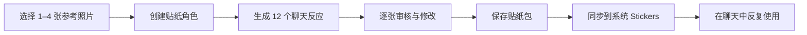
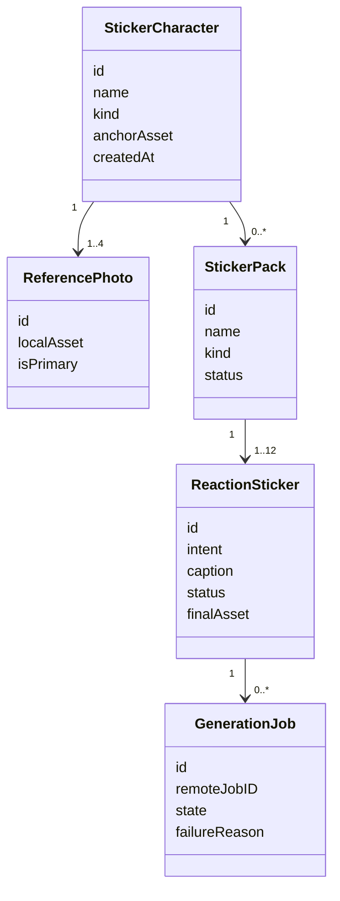
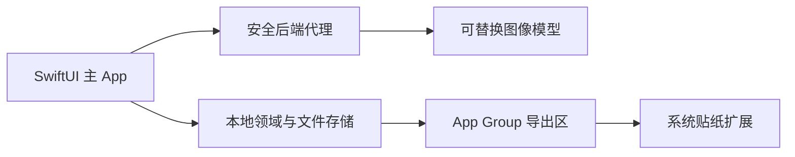

# AI 个性贴纸 iOS V1 产品与实施计划

> 状态：规划中，等待最终范围确认后进入实现  
> 最近更新：2026-08-02  
> 首发平台：iOS 17+  
> 计划代号：Personal Sticker V1

## 1. 文档目的

本文档是新版产品的长期执行基线，用来防止后续开发、上下文压缩或会话切换时遗失关键决定。产品术语以 [`CONTEXT.md`](../../CONTEXT.md) 为准；难以逆转的架构决定以 [`docs/adr`](../adr/) 下的 ADR 为准；持续执行状态记录在 [`.planning/personal-sticker-v1`](../../.planning/personal-sticker-v1/) 中。

本文将内容分为三类：

- **已确认**：产品负责人已经明确接受，实施时不得擅自改变。
- **实施建议**：为了完成 V1 给出的技术方案，可以在验证后调整。
- **待确认**：不阻碍当前文档完成，但在进入对应开发阶段前必须决定。

## 2. 一句话产品定义

用户上传 1–4 张本人、朋友或宠物的参考照片，AI 将主体转化为高相似度 Q 版贴纸角色，生成一套表达真实聊天语义的反应贴纸；用户审核后可直接在 iOS 系统贴纸入口中反复使用。

产品的高频行为不是“不断生成图片”，而是：

> 制作一次，在日常聊天中反复使用。

## 3. 背景与问题诊断

### 3.1 旧产品的问题

当前“贴纸日记”同时包含拍照抠图、贴纸库、日历、AI 日记、复杂编辑器、纸张模板、分享、成就、订阅和小组件。它的问题不是功能数量不足，而是没有形成一个足够高频、低成本、容易理解的核心用途。

用户必须经历“拍照—抠图—整理—生成或写日记—排版—分享”才能得到完整价值。这个链路要求用户建立新的记录习惯，不能自然依附在普通人已经每天发生的行为上。

### 3.2 新产品的机会

聊天是已有的高频行为。用户愿意在聊天里反复使用能够代表自己、朋友或宠物的表情。现有工程已经具备照片选择、相机采集、本机主体抠图和透明贴纸渲染等基础能力，新产品可以把这些能力从“日记素材”重新组织为“个人表达工具”。

### 3.3 当前工程风险

- 主界面文件接近 12,000 行，混合了界面、导航、网络、持久化、图片处理和业务规则，不能作为新版结构继续扩展。
- 核心贴纸数据目前主要依赖 `UserDefaults` 和图片文件，且只保留最近 50 张，不符合长期贴纸库需求。
- 当前客户端源码中存在直接嵌入的百炼 API 凭证。该凭证必须撤销和轮换，任何新代码不得把云服务密钥放入 iOS 安装包。
- 用户的 `main` 工作区存在未提交改动，并且本地比 `origin/main` 多一个提交。新版开发必须继续使用独立分支和隔离工作树，不能直接覆盖这些改动。

## 4. 已确认的产品决策

| 决策 | 结论 | 原因 |
|---|---|---|
| 产品中心 | 从日记改为个人聊天贴纸 | 贴纸复用能够依附已有聊天行为，日记要求培养新习惯 |
| 平台 | V1 仅制作 iOS | 当前工程是原生 iOS，系统 Stickers 是最完整的复用入口 |
| 商店身份 | 使用新的 App Store 记录和 Bundle ID | 产品目的、品牌、数据模型、隐私和未来商业化均已改变 |
| 旧产品 | 旧“贴纸日记”停止销售但不删除记录 | 避免继续获客，同时保留旧记录和 Bundle ID 的管理边界 |
| 旧数据 | 不迁移旧日记、贴纸、成就或订阅状态 | 现有用户规模不足以证明迁移和兼容成本合理 |
| 默认风格 | 高相似度 Q 版 | 保留身份识别，同时允许夸张表情和动作 |
| 生成方式 | 参考图驱动的 AI 图像编辑 | 真正改变表情和姿势，而不是只给抠图增加装饰 |
| 文字处理 | 图片模型不生成文字，中文由本机渲染 | 避免错字，支持编辑、统一样式和无障碍描述 |
| 首套内容 | 固定的 12 个通用聊天意图 | 用户无需理解提示词即可立即获得可用表情包 |
| 系统入口 | 主 App 制作管理，系统 Stickers 负责日常复用 | 让发送贴纸不依赖反复打开主 App |
| AI 安全 | 云 AI 必须经过后端代理 | 防止密钥泄露，并保持模型提供商可替换 |
| 商业化 | V1 暂不接广告、订阅或内购 | 先验证核心产品，避免商业化干扰制作与复用体验 |

相关 ADR：

- [0001：使用平台原生贴纸交付入口](../adr/0001-use-platform-native-sticker-delivery.md)
- [0002：生成参考图驱动的反应贴纸](../adr/0002-generate-reference-based-reaction-stickers.md)
- [0003：不迁移旧日记数据](../adr/0003-relaunch-without-legacy-data-migration.md)
- [0004：作为新的 App Store 产品发布](../adr/0004-launch-as-a-new-app-store-product.md)

## 5. V1 目标与非目标

### 5.1 V1 必须实现

1. 用户可以从相册选择或拍摄 1–4 张参考照片。
2. 系统能够创建一个可复用、可继续补充参考图的贴纸角色。
3. AI 能够针对 12 个固定聊天意图生成不同的表情和动作。
4. 用户可以逐张查看生成状态和结果，不因单张失败失去整个贴纸包。
5. 用户可以删除、修改短句、重新生成单张贴纸。
6. 中文短句能够准确、清晰、一致地渲染到最终贴纸。
7. 完成后的贴纸包能够在主 App 中长期保存和管理。
8. 完成后的贴纸能够进入 iOS 系统 Stickers 体验，并且离线可用。
9. 用户能够删除角色、贴纸包及其关联图片。
10. 云端不保存客户端密钥，参考照片的上传、保留和删除边界清晰可见。

### 5.2 V1 明确不做

- 不做日记、日历、生活回顾、成就或打卡。
- 不迁移旧“贴纸日记”的任何用户数据。
- 不做 Android、Web 或 macOS 独立版本。
- 不做社区、公开素材市场、关注、评论或排行榜。
- 不做账号体系、好友关系或跨平台登录。
- 不做广告、订阅、点数、付费主题包或其他商业化。
- 不做开放式提示词广场。
- 不做无限画风和复杂专业图片编辑器。
- 不做批量导入聊天记录或读取用户通讯录。
- 不承诺仅凭一张低质量照片一定能够保持人物相似度。

## 6. 核心用户流程



### 6.1 首次启动

首次启动只解释三件事：

1. 用自己的照片创建贴纸角色。
2. AI 会改变表情和动作，但努力保留身份特征。
3. 完成后可在系统贴纸入口中使用。

首次引导不出现日记概念、商业化、主题市场或长篇权限说明。照片权限在用户主动选择照片时再请求，避免启动即索取权限。

### 6.2 创建贴纸角色

用户可以创建以下类型的贴纸角色：

- 自己
- 朋友或家人
- 宠物
- 其他具有明确外观特征的主体

参考照片要求：

- 至少 1 张，最多 4 张。
- 推荐至少包含一张清晰正脸或主体正面。
- 避免严重遮挡、多人重叠、极暗、强滤镜或过度压缩。
- 用户能够指定“主参考图”，其余照片作为身份补充。
- 每张照片在上传前显示缩略图，支持移除和重新选择。

用户提交前必须确认其拥有使用照片和生成贴纸的权利。涉及他人或未成年人的图片时，界面应明确提醒需要获得适当同意。

### 6.3 身份参考策略

V1 不增加单独的“角色锚点生成—用户确认”步骤。用户选好 1–4 张照片后直接生成通用聊天包，避免在核心流程中多一次等待和判断。

身份提示词只作为辅助控制，不作为相似度保障。服务端可以明确要求保留脸型、五官间距、发际线和关键配饰，并避免夸张放大眼睛或改变脸部轮廓。生成结果不够像时，优先引导用户补充正脸、轻微侧脸和自然表情参考，或重新生成不满意的单张贴纸，而不是增加强制锚点确认页。

### 6.4 生成通用聊天包

首套贴纸固定覆盖以下 12 个聊天意图：

| 短句 | 目标语义 | 推荐表情与动作方向 |
|---|---|---|
| 收到 | 确认信息 | 认真点头、敬礼或明确确认手势 |
| 好的 | 友好同意 | 微笑点头、OK 手势 |
| 哈哈哈 | 强烈开心 | 闭眼大笑、笑出眼泪、身体后仰 |
| 无语 | 无奈或不认同 | 半眯眼、侧目、身体僵住 |
| 震惊 | 意外 | 睁大眼、张嘴、身体后缩 |
| 生气 | 明确不满 | 鼓脸、皱眉、握拳或冒火 |
| 委屈 | 难过求安慰 | 眼含泪光、低头、缩成一团 |
| 不要 | 拒绝 | 双手交叉、摇头或后退 |
| 求求了 | 请求 | 双手合十、期待或泪眼 |
| 谢谢 | 感谢 | 鞠躬、双手捧心或递出爱心 |
| 在路上 | 即将到达 | 向前跑、带速度线或挥手 |
| 晚安 | 结束聊天 | 裹被子、抱枕头或安静睡觉 |

生成要求：

- 每张图只包含一个贴纸角色。
- AI 输出不包含文字、水印、边框或复杂背景。
- 表情和动作必须优先表达聊天意图，而不是只追求画面可爱。
- 角色身份、画风、比例和主要配色应在整套中一致。
- 每个意图是独立的生成项，具有独立状态和重试次数。
- 服务端返回原始生成图；自动去背景、主体裁切、安全留白、白边和中文文字由统一的本地渲染管线处理，不依赖模型正确生成透明背景。

### 6.5 生成进度

生成页面不能只显示一个无限转圈。12 张贴纸应分别显示：

- 等待中
- 正在生成
- 已完成
- 失败，可重试
- 被内容安全规则阻止，需要更换照片或描述
- 已取消

用户可以退出生成页面，稍后从本地任务状态继续查看。应用被系统终止后，任务仍可通过服务端 `jobId` 恢复状态。

### 6.6 审核贴纸包

审核页以 3 列网格展示 12 张结果，并提供：

- 单张全屏预览
- 原始短句编辑
- 字体大小和文字位置的有限调整
- 单张重新生成
- 删除不满意结果
- 恢复默认短句
- 保存贴纸包

V1 不做自由图层编辑器。用户可以调整的内容必须受控，避免重新制造复杂手账编辑器。

**实施建议**：至少 8 张贴纸可用时允许保存整套；不足 8 张时继续引导重试，但不阻止用户退出并保留当前进度。最终阈值需要通过 TestFlight 验证。

### 6.7 贴纸库与返回使用

主 App 的日常首页建议只保留两个一级入口：

- **制作**：创建新角色或为现有角色生成新主题包。
- **贴纸包**：浏览已有角色、贴纸包、最近使用和收藏。

设置从导航栏进入，不占用一个高频标签页。

贴纸库需要支持：

- 按贴纸角色分组。
- 查看角色拥有的所有贴纸包。
- 按短句或聊天意图搜索。
- 收藏和取消收藏。
- 最近使用排序。
- 重命名角色与贴纸包。
- 删除单张贴纸、整套贴纸包或整个角色。
- 删除前说明关联影响，删除后同步更新系统贴纸资源。

### 6.8 iOS 系统 Stickers

主 App 负责创建、审核、编辑和管理；系统贴纸扩展只负责快速浏览和发送已经批准的贴纸。

系统入口必须满足：

- 不依赖网络。
- 不显示广告、购买、营销或生成入口。
- 不读取原始参考照片。
- 只读取经过主 App 导出的最终贴纸文件和必要元数据。
- 主 App 删除贴纸后，扩展在下一次刷新时同步移除。
- 每张贴纸具备本地化的无障碍替代描述，例如“我的猫咪说晚安”。

## 7. 信息架构与页面清单

| 页面 | 主要职责 | 关键状态 |
|---|---|---|
| 首次引导 | 解释产品价值和隐私边界 | 首次、已看过 |
| 制作首页 | 新建角色、继续未完成任务、查看最近角色 | 空、处理中、有角色 |
| 参考图选择 | 选择 1–4 张照片并检查质量 | 不足、合格、权限拒绝 |
| 角色确认 | 确认角色锚点是否相似 | 生成中、满意、不满意、失败 |
| 贴纸包生成 | 展示 12 个独立生成项 | 等待、生成、完成、失败、取消 |
| 贴纸包审核 | 逐张编辑、重试、删除和保存 | 不完整、可保存、已保存 |
| 贴纸包库 | 查看角色、贴纸包、收藏和最近使用 | 空、列表、搜索无结果 |
| 贴纸包详情 | 管理一套贴纸并同步系统入口 | 正常、部分缺失、同步失败 |
| 设置 | 隐私、数据删除、支持、版本信息 | 正常、清理中 |

## 8. 领域模型



### 8.1 核心实体

**StickerCharacter（贴纸角色）**

- 用户长期识别和管理的主体。
- 可以是人、宠物或其他主体。
- 持有角色锚点和参考照片关联，但不直接等同于某张照片。

**ReferencePhoto（参考照片）**

- 只用于确定角色外观和生成结果。
- 区分主参考图与补充参考图。
- 客户端与服务端具有不同的保留策略。

**StickerPack（贴纸包）**

- 围绕一个贴纸角色和一个聊天场景组织。
- V1 只有 `coreReaction`，后续可增加工作、朋友、情侣、宠物等主题包。

**ReactionSticker（反应贴纸）**

- 对应一个明确聊天意图。
- AI 图片层与本地文字层分离。
- 保存原始生成资产、最终渲染资产和扩展用压缩资产的关联。

**GenerationJob（生成任务）**

- 记录远程任务、重试、失败原因和恢复状态。
- 单张贴纸可以有多个生成尝试，但只能有一个当前批准结果。

## 9. iOS 技术架构

### 9.1 总体结构



### 9.2 客户端实施建议

- 使用 SwiftUI 和 iOS 17 Observation 模型。
- 使用 `NavigationStack` 和枚举路由，避免多个互斥布尔值控制页面。
- 共享服务通过环境注入；功能内部状态尽量保持局部。
- 每个功能拆分为独立目录和小型视图，业务逻辑不得重新集中到单文件。
- 异步生成使用明确的加载、部分完成、失败、取消和恢复状态。
- 预览和 UI 测试默认使用 Mock 服务，不连接真实模型。

建议目录：

```text
PersonalStickers/
├── App/
│   ├── PersonalStickersApp.swift
│   ├── AppRoute.swift
│   └── AppEnvironment.swift
├── Domain/
│   ├── StickerCharacter.swift
│   ├── StickerPack.swift
│   ├── ReactionSticker.swift
│   └── GenerationJob.swift
├── Features/
│   ├── Onboarding/
│   ├── CreateCharacter/
│   ├── GeneratePack/
│   ├── ReviewPack/
│   ├── StickerLibrary/
│   └── Settings/
├── Services/
│   ├── StickerGenerationService.swift
│   ├── MockStickerGenerationService.swift
│   ├── StickerRenderingService.swift
│   └── StickerExtensionSyncService.swift
├── Persistence/
│   ├── StickerRepository.swift
│   └── AssetStore.swift
└── Shared/
    ├── ConversationIntent.swift
    └── StickerAssetManifest.swift

PersonalStickersExtension/
├── MessagesViewController.swift
├── StickerBrowserDataSource.swift
└── Info.plist
```

### 9.3 本地存储

**实施建议**：

- 使用 SwiftData 或一个轻量结构化数据库保存实体元数据。
- 原始参考图、角色锚点、生成原图和最终 PNG 作为文件保存，不作为数据库大字段或 `UserDefaults` 数据。
- 数据库只保存稳定 ID、相对路径、状态、时间和关系。
- App Group 中只复制扩展需要的最终贴纸和清单，不复制原始照片。
- 删除角色时通过引用关系清理所有孤立文件。
- 不设置类似旧版“只保留最近 50 张”的静默上限。

SwiftData 是否最终采用，需要在 Phase 1 通过最小原型验证 App Group、迁移和测试便利性后决定。

### 9.4 本地贴纸渲染

本地渲染流程：

1. 接收无文字的 AI 生成图。
2. 检查透明度；若背景不是有效透明区域，则自动执行主体分割和去背景。
3. 按非透明像素边界自动裁剪主体，保留统一安全留白，并将主体居中放入正方形画布。
4. 使用统一白边和阴影。
5. 根据意图模板放置准确中文短句。
6. 生成主 App 预览资产。
7. 生成符合系统贴纸尺寸和文件大小要求的扩展资产。
8. 写入替代文本和资产清单。

后处理验收必须包含：画面只有一个主要主体、四角透明、主体没有被切断、边缘无明显底色毛边、浅色和深色聊天背景均可辨认。去背景失败时保留 AI 原图供审核，但不得把不透明矩形直接发布到系统贴纸面板。

V1 在设备端优先使用 iOS 17 Vision 前景实例分割。若模型的浅色纹理背景被 Vision 整体识别为前景，则使用从画布边缘开始的近似背景色连通区域清理作为补充；该补充只移除与边缘连通的背景，降低误删人物内部浅色区域的风险。

字体、文字位置和边框样式可以形成有限的内部模板，但 V1 不向用户暴露复杂图层编辑能力。

## 10. AI 与后端计划

### 10.1 为什么必须有后端

- iOS 安装包无法安全保存模型 API 密钥。
- 服务端可以统一做请求签名、配额、防滥用、内容安全和失败重试。
- 模型更换不需要强制用户升级 App。
- 服务端可以隐藏不同模型之间的请求和响应差异。

当前源码中的客户端凭证在任何真实测试前都必须撤销和轮换，并检查 Git 历史中是否仍然存在可用凭证。

### 10.2 客户端与后端边界

客户端负责：

- 照片选择和必要的本地压缩。
- 明确告知上传目的并获得用户动作确认。
- 创建生成任务并显示进度。
- 下载生成结果。
- 最终中文文字、透明背景修正、白边和系统规格渲染。
- 本地保存、删除和系统贴纸同步。

后端负责：

- 接收有限数量的参考图片。
- 保存服务端模型凭证。
- 创建角色锚点和反应贴纸任务。
- 统一模型提示词、负向约束和角色一致性参数。
- 内容安全、重试、任务状态和错误归一化。
- 在承诺时间内删除临时参考图片和生成中间资产。

### 10.3 建议的服务接口

V1 接口保持最小化：

- `POST /v1/characters/anchor`：上传参考图并创建角色锚点。
- `POST /v1/packs/core`：为已确认角色创建通用反应包任务。
- `GET /v1/jobs/{jobId}`：查询整包或单张任务状态。
- `POST /v1/stickers/{stickerId}/regenerate`：重新生成一个意图。
- `POST /v1/jobs/{jobId}/cancel`：取消仍可终止的任务。
- `DELETE /v1/uploads/{uploadId}`：主动删除服务端参考数据。

客户端不得直接依赖百炼、Gemini 或 OpenAI 的原始响应格式。

### 10.4 模型选择方法

首个候选可以从百炼图像模型开始，因为现有项目已经使用百炼服务；但不能仅因为“已经接入”就直接决定生产模型。需要使用同一套经授权的参考图片和提示词，对候选模型进行盲测。

建议评分权重：

| 维度 | 权重 | 说明 |
|---|---:|---|
| 身份相似度 | 35% | 用户能否立即认出本人或宠物 |
| 表情动作语义 | 25% | 是否真正表达对应聊天意图 |
| 整套一致性 | 15% | 12 张之间的角色、比例和画风是否一致 |
| 指令遵循 | 10% | 是否保持单角色、无文字、简单背景 |
| 失败与重试稳定性 | 5% | 相同输入是否频繁得到不可用结果 |
| 延迟 | 5% | 用户等待是否可以接受 |
| 单套成本 | 5% | 当前虽不商业化，但必须可持续测试 |

测试集至少覆盖：

- 不同年龄和外观特征的人物。
- 眼镜、帽子、长发、短发等关键识别物。
- 猫、狗以及不同毛色宠物。
- 单张参考与多张参考。
- 明亮、昏暗、侧脸和轻度遮挡照片。
- 同一参考图的基础提示词与加强身份约束提示词 A/B 结果，用实际相似度评分决定是否保留新增约束。

所有测试图片必须由开发者拥有或获得明确授权，不能使用未经许可的公众人物照片。

## 11. 隐私、安全与内容边界

### 11.1 客户端密钥

- 新 App、扩展和配置文件中不得出现生产 API 密钥。
- 当前已暴露凭证必须撤销和轮换。
- 提交前运行仓库秘密扫描。
- 后端密钥只能存在于部署平台的加密环境变量中。

### 11.2 用户照片

- 只在用户主动创建角色时上传选中的照片。
- 不请求与功能无关的整库相册访问。
- 不将照片或人脸特征提供给广告 SDK 或普通分析 SDK。
- 隐私政策必须说明处理目的、第三方模型提供商、保留时长、删除方式和联系方式。
- 用户删除角色时，本地参考图和相关生成资产全部清理。
- 服务端保留时长尚待确认；实施建议是任务结束后 24 小时内自动删除原始参考图，并支持立即删除。

### 11.3 生成他人形象

- 提交前显示权利与同意确认。
- 禁止欺骗、骚扰、色情、仇恨、违法或冒充用途。
- 对未成年人照片采用更严格的隐私文案和内容安全策略。
- 不提供公众人物模仿模板或绕过模型安全规则的自定义提示词入口。

## 12. 可靠性和失败体验

必须覆盖以下失败场景：

- 相册权限拒绝或仅允许部分照片。
- 图片损坏、格式不支持或主体不可识别。
- 参考图包含多个难以区分的主体。
- 网络离线、超时或切换网络。
- 后端不可用、限流或任务丢失。
- 内容安全拦截。
- 12 张中部分失败。
- 下载成功但本地渲染失败。
- 存储空间不足。
- App Group 写入失败或扩展刷新失败。
- 用户在生成中退出、杀死 App 或取消任务。

错误信息必须告诉用户：发生了什么、哪些结果已经保留、下一步可以做什么。不得用“生成失败，请重试”覆盖所有情况。

## 13. 无障碍、语言和视觉质量

- V1 以简体中文为首发语言，项目和商店元数据必须正确声明中文支持。
- 所有按钮、照片选择、生成状态和贴纸均提供 VoiceOver 标签。
- 贴纸替代文本包含角色名称和聊天意图，不描述无关画面细节。
- 中文字体必须在小尺寸贴纸上仍然清晰。
- 深色、浅色聊天背景下都必须检查白边、阴影和文字对比度。
- 动画尊重“减弱动态效果”设置。
- 生成过程提供明确进度，但避免使用虚假的百分比。

## 14. 分析与成功指标

V1 不接广告 SDK。是否接入第三方分析仍待确认；在此之前优先使用 App Store Connect、崩溃报告、服务器匿名任务统计和本地调试日志。

不得上传参考照片、贴纸图片、角色名称或用户编辑过的短句作为分析事件。

建议事件仅包含非内容状态：

- 首次引导完成。
- 角色创建开始、成功或失败。
- 通用包生成开始、完成或部分失败。
- 单张重新生成次数。
- 贴纸包保存。
- 系统扩展同步成功或失败。
- 删除角色或贴纸包。

首轮 TestFlight 建议关注：

1. **首包完成率**：开始创建角色的测试者中，有多少人最终保存一套贴纸包。
2. **首次可用结果时间**：从选择照片到看到第一张可审核贴纸的时间。
3. **首轮接受度**：12 张中无需重新生成即可接受的数量。
4. **单张重做率**：哪些意图最常失败或不符合语义。
5. **角色相似度主观评分**：测试者是否认为“一眼能认出”。
6. **扩展成功率**：保存后能否在系统贴纸入口看到并发送。
7. **崩溃和任务恢复**：生成期间退出或终止后能否恢复。

系统贴纸扩展中的真实聊天使用不应为了分析而上传个人活动。可以在本地维护“最近使用”，但是否上传汇总数据需要单独的隐私决策。

## 15. 测试计划

### 15.1 单元测试

- 12 个聊天意图和默认短句映射。
- 生成任务状态机和合法状态转换。
- 单张失败、重试和取消逻辑。
- 文字模板、尺寸计算和文件压缩。
- 数据删除和孤立文件清理。
- App Group 清单生成与差异同步。

### 15.2 集成测试

- Mock 后端创建整包并逐张完成。
- 后端任务在 App 重启后恢复。
- 部分结果失败时仍可审核成功结果。
- 删除主 App 数据后扩展资源同步删除。
- 网络从离线恢复后继续轮询任务。

### 15.3 UI 测试

- 首次引导到保存首包的完整路径。
- 相册权限拒绝和重新授权。
- 参考图增加、删除和主图选择。
- 生成进度、失败、重试和取消。
- 修改短句并保存。
- 收藏、搜索和删除贴纸。
- 动态字体、VoiceOver 和减弱动态效果。

### 15.4 真机验证

- 至少一台低端受支持设备和一台当前主流设备。
- 不同尺寸 iPhone 和横竖屏安全区。
- 系统 Stickers 安装、刷新、发送和离线使用。
- 真实网络波动、后台恢复和低存储空间。
- 透明 PNG 在浅色和深色消息背景中的效果。

## 16. 实施阶段与退出条件

### Phase 0：计划与范围确认

交付物：

- 领域术语表。
- 四条已接受 ADR。
- 本详细计划。
- 持久化任务计划、发现记录和进度日志。

退出条件：

- 产品负责人确认 V1 范围。
- 明确哪些开放问题会阻塞 Phase 1，哪些可以延后。

### Phase 1：安全脚手架和 Mock 垂直切片

工作内容：

- 从安全基线创建独立实现分支和工作树。
- 新建模块化 SwiftUI App 壳与系统贴纸扩展目标。
- 建立路由、依赖注入、Mock 生成服务和预览。
- 使用固定演示素材完成“选图—生成进度—审核—保存—扩展同步”的假数据闭环。
- 不接真实 AI，不复制现有客户端密钥。

退出条件：

- 模拟器构建通过。
- Mock 首包流程可以完整操作。
- 主要页面拥有加载、成功、空和失败预览。
- 没有新增巨型单文件。

### Phase 2：本地域模型与贴纸库

工作内容：

- 实现实体、仓储和文件资产存储。
- 实现角色、贴纸包、单张贴纸、收藏、最近使用和删除。
- 实现本地中文文字与最终 PNG 渲染。
- 实现 App Group 导出清单。

退出条件：

- App 重启后数据和图片保持一致。
- 删除不会留下孤立文件。
- 贴纸数量没有静默上限。
- 离线时可以浏览、搜索和导出已有贴纸。

### Phase 3：真实 AI 后端与角色一致性

工作内容：

- 撤销和轮换旧凭证。
- 确定后端托管位置和首个图像模型。
- 实现后端代理、任务状态、内容安全和自动删除。
- 建立受控模型测试集并完成对比。
- 接入角色锚点和 12 个独立反应任务。
- 实现自动去背景、主体裁切、透明边缘清理和正方形安全留白，并用浅色/深色背景验收。

退出条件：

- 客户端秘密扫描无生产凭证。
- 真实照片可以完成至少一套端到端生成。
- 不透明模型输出能够自动变成边缘可接受、主体完整的透明贴纸资产。
- 单张失败不会破坏整包。
- 服务端照片删除策略可以验证。

### Phase 4：系统 Stickers 集成

工作内容：

- 完成扩展数据读取、分组、刷新和发送。
- 验证最终资产规格、文件大小和替代文本。
- 验证主 App 删除与扩展同步。

退出条件：

- 保存后的贴纸能在真机系统入口出现。
- 飞行模式下可以发送已有贴纸。
- 扩展没有广告、购买、网络依赖或原始照片访问。

### Phase 5：产品打磨和 TestFlight

工作内容：

- 完成错误处理、可访问性、性能、隐私说明和支持页面。
- 邀请小规模测试者完成真实创建和复用流程。
- 根据失败意图、相似度和等待体验修正提示词与流程。

退出条件：

- 无阻塞级崩溃和数据丢失。
- 核心 TestFlight 指标达到双方确认的最低阈值。
- 隐私政策和照片删除流程经过人工验证。

### Phase 6：新 App Store 产品发布

工作内容：

- 确定产品名、图标、分类、关键词、截图和演示视频。
- 创建新 App Store 记录、Bundle ID、App Group 和审核信息。
- 在审核备注中解释参考图 AI、系统贴纸扩展和测试方式。
- 新产品准备上线后，再把旧“贴纸日记”停止销售。

退出条件：

- 新产品审核通过并可下载。
- 旧产品只停止销售，未删除 App Store Connect 记录。
- 发布版本、隐私标签和实际网络行为一致。

## 17. V1 完成定义

只有以下条件全部满足，才能称为“App 已做出来”：

- [ ] 新 App 使用独立 Bundle ID 和模块化工程结构。
- [ ] 用户能用 1–4 张照片创建贴纸角色。
- [ ] 用户能生成 12 个语义明确的反应贴纸。
- [ ] AI 结果保持可接受的角色相似度和整套一致性。
- [ ] 用户能编辑文字、删除结果和重新生成单张。
- [ ] 生成中退出或部分失败不会丢失已完成内容。
- [ ] 贴纸包能够本地长期保存、搜索、收藏和删除。
- [ ] 最终贴纸能够在真机系统 Stickers 中离线发送。
- [ ] 客户端和扩展不包含生产 API 密钥。
- [ ] 用户可以理解照片如何上传、保存和删除。
- [ ] 核心单元、集成、UI 和真机验证通过。
- [ ] 新 App Store 商品页、隐私标签和审核说明准备完成。

## 18. 已知风险与应对

| 风险 | 影响 | 应对 |
|---|---|---|
| 单张照片导致角色不像 | 用户立即失去信任 | 支持最多四张参考图，在审核页说明可补充照片或重新生成不满意的单张 |
| 12 张之间角色漂移 | 整套不可用 | 每张复用角色锚点和一致提示词，允许单张重做 |
| 模型无法正确表达语义 | 结果只是“好看”而不实用 | 为每个意图定义动作要求并单独统计重做率 |
| 生成等待时间过长 | 用户中途退出 | 独立任务进度、后台恢复、优先展示已完成结果 |
| 云服务成本失控 | 无法大规模测试 | V1 设置服务端配额和测试白名单，商业化以后再决定 |
| 客户端密钥再次泄露 | 账户盗用和费用风险 | 后端代理、秘密扫描、密钥轮换、无客户端直连 |
| 照片隐私不清楚 | 审核和用户信任风险 | 最小上传、明确同意、短期保留、立即删除入口 |
| 系统贴纸扩展能力受限 | 高频入口失败 | Phase 1 先用 Mock 资产做真机技术验证，不等 AI 完成 |
| 重新出现巨型视图 | 维护成本复发 | 小型功能视图、明确服务边界、每阶段编译验证 |
| 新品类同质化 | 无法获客 | 强调“本人/宠物高相似度 + 真实聊天语义 + 系统复用” |

## 19. 回滚与仓库安全

- 任何实现修改都必须在 `codex/` 前缀的独立分支完成。
- 不直接修改或清理用户当前带有未提交内容的 `main` 工作区。
- 每个实施阶段独立提交、推送并通过 Pull Request 审查。
- 旧“贴纸日记”代码在新垂直切片通过前不做破坏性删除。
- 如果 AI 供应商验证失败，客户端继续保留 Mock 流程和提供商抽象，可替换模型而不推翻 UI 与本地域模型。
- 如果系统 Stickers 动态集成不可达到目标，暂停发布并重新评估入口，不用复杂日记功能填补范围。

## 20. 待确认事项

以下事项尚未决定，不能在后续会话中被误写成已确认结论：

1. 最终产品名称、图标和品牌风格。
2. 后端托管平台。
3. 首个生产图像模型。
4. 服务端参考照片的确切保留时长；当前建议不超过 24 小时。
5. 是否在 V1 加入 iCloud 同步；当前建议推迟。
6. 是否加入第三方分析 SDK；当前建议先不加入。
7. TestFlight 的具体成功阈值和测试人数。
8. 角色范围是否在首版支持“其他物品”，还是只支持人物与宠物。

## 21. 获得范围确认后的第一批动作

1. 撤销当前已暴露的百炼凭证，不在对话或提交中展示新凭证。
2. 从干净远端基线创建新的 `codex/` 实现分支和隔离工作树。
3. 使用临时内部名称建立新 App 与系统贴纸扩展目标，不等待最终品牌名。
4. 先用 Mock 数据完成整个用户流程和系统贴纸真机验证。
5. 完成本地域模型与文件存储后，再接入真实 AI 后端。
6. 每个阶段更新本计划、`findings.md` 和 `progress.md`，并记录所有验证结果。
